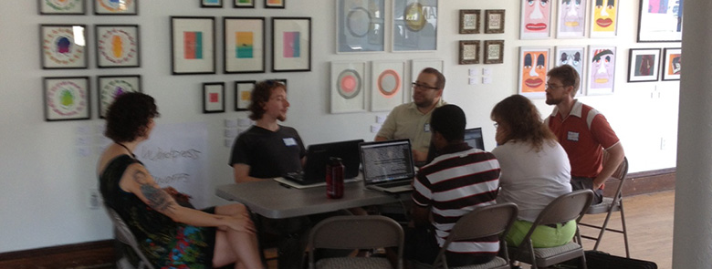
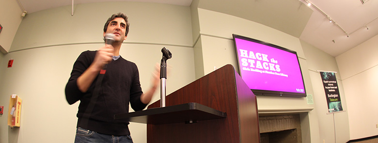
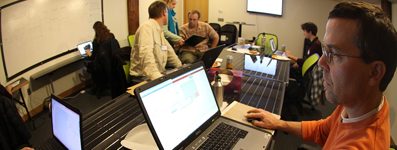
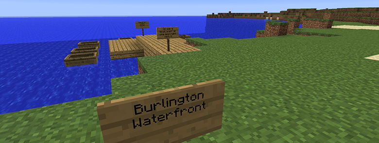
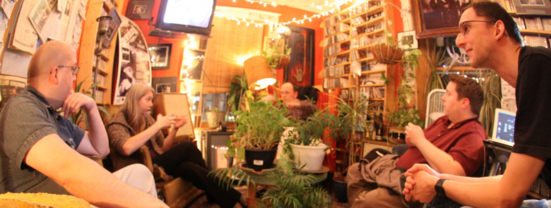
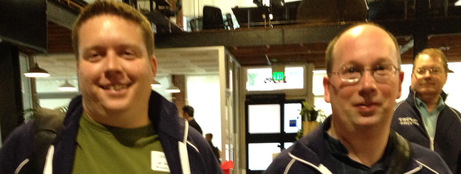
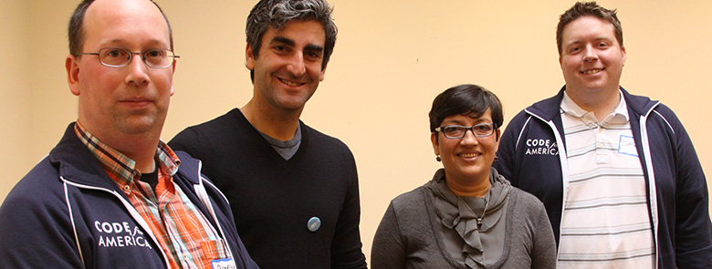

<header class="jumbotron code-for-btv-header">
    

        <h1 class="visible-xs visible-sm"><small>Code for BTV</small>  2013 Annual Report</h1>
        <h1 class="hidden-xs hidden-sm">  2013 Annual Report</h1>
        
Code for BTV was launched with the National Day of Civic Hacking in June of 2013. Over 60 people have actively participated in two hackathons, six monthly meetups, numerous projects, and several collaborations. Six apps have been built, 11 apps have been redeployed, and work has started on several other projects. Four major collaborations have been pursued on strategic initiatives in addition to broader collaborations with at least six organizations and numerous individuals.

        <blockquote>
            
"Burlington's membership and participation in the Code for America Brigade will allow us to continue innovating within our City and provide a tremendous opportunity to collaborate with other innovative cities around the country."

            <footer class="text-right"><small><cite>Burlington Mayor Miro Weinberger</cite></small></footer>
        </blockquote>
    

</header>
<section>
    

        

            

                <h1 class="section-heading">Hackathons</h1>
            

            

                <article class="row">
                    

                        

                            
                            

                                
<small>Participants at the National Day of Civic Hacking | <small>Credit: Alexandra Tursi</small></small>

                            

                        

                        <h1 class="h3">National Day of Civic Hacking <small>June 1 &amp; June 2</small></h1>
                        
Burlington's National Day of Civic Hacking attracted 50 civic hackers who worked on 10 different projects. Lakecraft, an educational tool that engages youth and adults in science by gamifying the Lake Champlain Basin, was started at the National Day of Civic Hacking. A team of volunteers working with the Vermont Digital Economy Project built WordPress websites for three Vermont non-profit organizations. An app for Green Up Vermont was built along with a Fish Stocking Schedule app. An instance of MediaWiki was installed for a Burlington City Wiki. A "School Juice" team brainstormed ways to begin providing electricity usage data from Burlington's new smart meters in some useful and open ways to the public. A Discourse discussion forum was installed and work was started on a Music Venue Directory for Big Heavy World, a non-profit organization that promotes and preserves Vermont-made music.

                    

                    

                        

                            

                                <h1 class="panel-title">In the News</h1>
                            

                            

                                <a href="http://www.wptz.com/news/vermont-new-york/burlington/Coders-designers-hack-for-change/-/8869880/20394732/-/13wdolaz/-/index.html" class="list-group-item">
                                    <small>June 2, 2013 | <em>WPTZ</em></small> 
                                    "Coders, designers hack for change"
                                    <i class="fa fa-arrow-circle-right"> </i>
                                </a>
                                <a href="http://www.wcax.com/story/22481858/national-day-of-civic-hacking-hits-vermont" class="list-group-item">
                                    <small>June 2, 2013 | <em>WCAX</em></small> 
                                    "National Day of Civic Hacking hits Burlington"
                                    <i class="fa fa-arrow-circle-right"> </i>
                                </a>
                                <a href="http://www.burlingtonfreepress.com/apps/pbcs.dll/article?AID=2013306020017" class="list-group-item">
                                    <small>June 1, 2013 | <em>Burlington Free Press</em></small> 
                                    "A National Day of Civic Hacking in BTV"
                                    <i class="fa fa-arrow-circle-right"> </i>
                                </a>
                                <a href="http://digital.vpr.net/post/when-computer-hacker-becomes-good-guy" class="list-group-item">
                                    <small>May 31, 2013 | <em>Vermont Public Radio</em></small> 
                                    "When The Computer Hacker Becomes 'The Good Guy'"
                                    <i class="fa fa-arrow-circle-right"> </i>
                                </a>
                                <a href="http://www.7dvt.com/2013national-day-civic-hacking-comes-vermont" class="list-group-item">
                                    <small>May 29, 2013 | <em>Seven Days</em></small> 
                                    "National Day of Civic Hacking Comes to Vermont"
                                    <i class="fa fa-arrow-circle-right"> </i>
                                </a>
                                <a href="http://www.wcax.com/story/22379200/civic-hacking" class="list-group-item">
                                    <small>May 21, 2013 | <em>WCAX</em></small> 
                                    "Civic hacking"
                                    <i class="fa fa-arrow-circle-right"> </i>
                                </a>
                            

                        

                    

                </article>
                

                <article class="row">
                    

                        

                            
                            

                                
<small>Burlington Mayor Miro Weinberger speaking at Hack the Stacks | <small>Credit: James Lockridge</small></small>

                            

                        

                        <h1 class="h3">Hack the Stacks <small>October 26 &amp; October 27</small></h1>
                        
Hack the Stacks was a civic hacking event held in collaboration with Fletcher Free Library. About 30 civic hackers participated in this event. Burlington Mayor Miro Weinberger opened the hackathon. Over the weekend, a "green" printing app was created to reduce unintentional and wasteful printing in Fletcher Free Library's public access computer center. A team of volunteers continued to work with the Vermont Digital Economy Project to create and update websites for Vermont non-profit organizations. The Lakecraft team used the hackathon as an opportunity to continue to work on the project and to attempt to recruit new members to the team.

                    

                    

                        

                            

                                <h1 class="panel-title">In the News</h1>
                            

                            

                                <a href="http://opensource.com/government/13/11/hackathon-change-community" class="list-group-item">
                                    <small>Nov 21, 2013 | <em>opensource.com</em></small> 
                                    "How a hackathon can transform your community"
                                    <i class="fa fa-arrow-circle-right"> </i>
                                </a>
                                <a href="http://www.techjamvt.com/2013/10/code-for-btv-hackathon-fletcher-free-library-burlington/" class="list-group-item">
                                    <small>Oct 29, 2013 | <em>Vermont Tech Jam</em></small> 
                                    "Code for BTV Hacks the Stacks at Fletcher Free Library"
                                    <i class="fa fa-arrow-circle-right"> </i>
                                </a>
                                <a href="http://nextcity.org/sharedcity/entry/what-can-a-bunch-of-burlington-coders-know-about-upgrading-a-140-library" class="list-group-item">
                                    <small>Oct 25, 2013 | <em>Next City</em></small> 
                                    "What Can a Bunch of Burlington Coders Know About Upgrading a 140-Year-Old Library?"
                                    <i class="fa fa-arrow-circle-right"> </i>
                                </a>
                                <a href="http://www.cctv.org/watch-tv/programs/hack-stacks" class="list-group-item">
                                    <small>Sept 30, 2013 | <em>Channel 17 / Town Meeting Television</em></small> 
                                    "Hack the Stacks"
                                    <i class="fa fa-arrow-circle-right"> </i>
                                </a>
                            

                        

                    

                </article>
            

        

    

    

</section>
<section>
    

        

            

                <h1 class="section-heading">Meetups</h1>
            

            

                

                    
                    

                        
<small>A participant at the CrisisCamp helps with the relief efforts in the Philippines after Super Typhoon Haiyan | <small>Credit: James Lockridge</small></small>

                    

                

                <article>
                    <h1 class="h3">June Meetup</h1>
                    
The first monthly Code for BTV meetup was held in June at CCTV Center for Media &amp; Democracy.

                </article>
                

                <article>
                    <h1 class="h3">July Meetup</h1>
                    
The July Code for BTV meetup was held at Office Squared (77 College Street), a coworking space in Burlington.

                </article>
                

                <article>
                    <h1 class="h3">August Meetup</h1>
                    
The August Code for BTV meetup was held at Office Squared (106 Main Street).

                </article>
                

                <article>
                    <h1 class="h3">September Meetup</h1>
                    
The September Code for BTV meetup was held at Office Squared (77 College Street). Burlington Telecom provided a gigabit Internet connection for this event.

                </article>
                

                <article>
                    <h1 class="h3">November Meetup</h1>
                    
The November Code for BTV meetup was held at Office Squared (77 College Street). Based on a conversation with Bill Morris, a Burlington resident and member of the Humanitarian OpenStreetMap Team, we hosted a CrisisCamp at this meetup to help with the relief efforts in the Philippines after Super Typhoon Haiyan. Burlington Telecom provided a gigabit Internet connection for this event.

                    <h2 class="h5">In the News</h2>
                    <ol class="list-unstyled">
                        <li>
                            <small>Nov 20, 2013 | <em>Seven Days</em></small>
                            <a href="http://www.7dvt.com/2013vermonters-help-philippines-relief-effort-digital-map-making">
                                "Vermonters Help the Philippines Relief Effort with Digital Map Making"
                                <i class="fa fa-arrow-circle-right"> </i>
                            </a>
                        </li>
                        <li>
                            <small>Nov 15, 2013 | <em>Vermont Tech Jam</em></small>
                            <a href="http://www.techjamvt.com/2013/11/help-map-storm-damaged-areas-philippines/">
                                "Help Map Storm-Damaged Areas of the Philippines This Weekend in Burlington"
                                <i class="fa fa-arrow-circle-right"> </i>
                            </a>
                        </li>
                    </ol>
                </article>
                

                <article>
                    <h1 class="h3">December Meetup</h1>
                    
The December Code for BTV meetup was held at Office Squared (77 College Street). Burlington Telecom provided a gigabit Internet connection for this event.

                </article>
            

        

    

    

</section>
<section>
    

        

            

                <h1 class="section-heading">Projects</h1>
            

            

                

                    
                    

                        
<small>Screenshot of Burlington Waterfront from Lakecraft | <small>Credit: Nick Floersch</small></small>

                    

                

                <article>
                    <nav class="pull-right">
                        <ul class="list-unstyled">
                            <li><a href="https://github.com/codeforbtv/adopt-a-drain" title="GitHub repository"><i class="fa fa-github fa-2x"> </i> GitHub repository</a></li>
                        </ul>
                    </nav>
                    <h1 class="h3">Adopt-a-Drain</h1>
                    
 

                    
Megan Moir of the Burlington Stormwater Management Program expressed interest in having an Adopt-a-Drain instance stood up in Burlington. A team of two volunteers are working to customize OpenOakland's Adopt-a-Drain app for use in Burlington. Brigade Captains Bradley Holt and Jason Pelletier plan to meet with Megan Moir in February of 2014 to discuss moving this project forward.

                </article>
                

                <article>
                    <nav class="pull-right">
                        <ul class="list-unstyled">
                            <li><a href="https://github.com/codeforbtv/discourse" title="GitHub repository"><i class="fa fa-github fa-2x"> </i> GitHub repository</a></li>
                        </ul>
                    </nav>
                    <h1 class="h3">Big Heavy World Discussion Forum</h1>
                    
 

                    
Big Heavy World is a non-profit organization that promotes and preserves Vermont-made music. During the National Day of Civic Hacking, a Discourse discussion forum was installed and customized for use by Vermont's musicians.

                </article>
                

                <article>
                    <nav class="pull-right">
                        <ul class="list-unstyled">
                            <li><a href="https://github.com/codeforbtv/live-music-venue-directory" title="GitHub repository"><i class="fa fa-github fa-2x"> </i> GitHub repository</a></li>
                        </ul>
                    </nav>
                    <h1 class="h3">Big Heavy World Live Music Venue Directory</h1>
                    
 

                    
The Big Heavy World Live Music Venue Directory is a tool for Vermont-based and touring artists to orient to the opportunities to perform in Vermont. It helps artists identify which venues are appropriate for them and provides the information needed to communicate with those venues. Work was started on the Music Venue Directory at the National Day of Civic Hacking.

                </article>
                

                <article>
                    <nav class="pull-right">
                        <ul class="list-unstyled">
                            <li><a href="http://bigheavyworld.com/music/hear-the-archive/" title="archive"><i class="fa fa-external-link-square fa-2x"> </i> archive</a></li>
                        </ul>
                    </nav>
                    <h1 class="h3">Big Heavy World Music Archive App</h1>
                    
 

                    
The Big Heavy World Music Archive App allows users to listen to an archive of over 10,000 tracks totalling more than 600 hours.

                </article>
                

                <article>
                    <nav class="pull-right">
                        <ul class="list-unstyled">
                            <li><a href="http://bigheavyworld.com/" title="website"><i class="fa fa-external-link-square fa-2x"> </i> website</a></li>
                        </ul>
                    </nav>
                    <h1 class="h3">Big Heavy World Website</h1>
                    
 

                    
Several volunteers worked to build an updated website to help Big Heavy World promote and preserve Vermont-made music. The official launch announcement will be in the spring of 2014.

                </article>
                

                <article>
                    <nav class="pull-right">
                        <ul class="list-unstyled">
                            <li><a href="http://burlingtonwiki.com/" title="wiki"><i class="fa fa-external-link-square fa-2x"> </i> wiki</a></li>
                        </ul>
                    </nav>
                    <h1 class="h3">Burlington City Wiki</h1>
                    
 

                    
An instance of MediaWiki was installed to create a Burlington City Wiki during the National Day of Civic Hacking.

                </article>
                

                <article>
                    <h1 class="h3">COTS Bed Coordination App</h1>
                    
 

                    
The Committee on Temporary Shelter (COTS) is looking to build a web application that will allow them to better coordinate with other Vermont housing organizations. This web application will allow a participating organization to see if a person seeking services has already sought these same services from another organization. This coordination will help ensure that important resources such as beds are being fully utilized for the benefit of those in need.

                </article>
                

                <article>
                    <nav class="pull-right">
                        <ul class="list-unstyled">
                            <li><a href="http://www.vpr.net/apps/fish-map/index" title="app"><i class="fa fa-external-link-square fa-2x"> </i> app</a></li>
                        </ul>
                    </nav>
                    <h1 class="h3">Fish Stocking Schedule</h1>
                    
 

                    
The Fish Stocking Schedule presents fish stocking data from Vermont Fish &amp; Wildlife in a visual format. This application was built during the National Day of Civic Hacking.

                    <h2 class="h5">In the News</h2>
                    <ol class="list-unstyled">
                        <li>
                            <small>Jun 11, 2013 | <em>Vermont Public Radio</em></small>
                            <a href="http://digital.vpr.net/post/want-reel-big-one-theres-app">
                                "Want To Reel In A Big One? There's An App For That"
                                <i class="fa fa-arrow-circle-right"> </i>
                            </a>
                        </li>
                    </ol>
                </article>
                

                <article>
                    <h1 class="h3">Fletcher Free Library Calendar App</h1>
                    
 

                    
Fletcher Free Library has three public meeting rooms. A team at Hack the Stacks documented some possible options for a web-based calendar app that staff could use to schedule the rooms, while allowing the public to see the current schedule.

                </article>
                

                <article>
                    <h1 class="h3">Fletcher Free Library "Green" Printing App</h1>
                    
 

                    
The "Green" Printing App is intended to reduce unintentional and wasteful printing in Fletcher Free Library's public access computer center. The app informs users how many pages they are about to print and the associated cost, providing an opportunity to avoid mistaken printing. This application was built at Hack the Stacks.

                </article>
                

                <article>
                    <h1 class="h3">Fletcher Free Library Statistics App</h1>
                    
 

                    
Work was started at Hack the Stacks on an application to track library statistics. Statistics for libraries are like revenue numbers for businesses. The web-based application would keep statistics on things like checkouts, door counts, website visits, computer center logins, Wi-Fi logins and volunteer hours.

                </article>
                

                <article>
                    <nav class="pull-right">
                        <ul class="list-unstyled">
                            <li><a href="https://github.com/EJEHardenberg/GreenUp" title="GitHub repository"><i class="fa fa-github fa-2x"> </i> GitHub repository</a></li>
                        </ul>
                    </nav>
                    <h1 class="h3">Green Up Vermont App</h1>
                    
 

                    
The Green Up Vermont App was designed to help volunteers coordinate their efforts during Green Up Day.

                </article>
                

                <article>
                    <nav class="pull-right">
                        <ul class="list-unstyled">
                            <li><a href="http://www.flickr.com/groups/lakecraft/" title="screenshots"><i class="fa fa-flickr fa-2x"> </i> screenshots</a></li>
                        </ul>
                    </nav>
                    <h1 class="h3">Lakecraft</h1>
                    
 

                    
Lakecraft is an educational tool that engages youth and adults in science by gamifying the Lake Champlain Basin using open GIS data and a custom modification to Minecraft. This project was started at the National Day of Civic Hacking and the team has continued to put significant efforts into the project since.

                </article>
                

                <article>
                    <h1 class="h3">School Juice</h1>
                    
 

                    
A "School Juice" team has been brainstorming ways to begin providing electricity usage data from Burlington's new smart meters in some useful and open ways to the public. This work started at the National Day of Civic Hacking.

                </article>
                

                <article>
                    <h1 class="h3">WordPress Websites for Vermont Non-Profit Organizations</h1>
                    
 

                    
Collaborating with the Vermont Digital Economy Project, volunteers working with Code for BTV have built or improved websites for over a dozen non-profit organizations and plan to work on many more of these websites. The Vermont Digital Economy Project has found that communities with digitally connected non-profit organizations are more resilient to natural disasters. These websites are helping to make Vermont non-profits more connected, and thus are making Vermont communities more resilient.

                </article>
            

        

    

    

</section>
<section>
    

        

            

                <h1 class="section-heading">Collaborations</h1>
            

            

                

                    
                    

                        
<small>Several members of the Civic Cloud Collaborative at Big Heavy World | <small>Credit: James Lockridge</small></small>

                    

                

                <article>
                    <h1 class="h3">Open Data</h1>
                    
The City of Burlington Mayor's Office recently started work on an open data portal, and Code for BTV is working with them on this initiative. The State of Vermont is also working on its own open data portal. Brigade Captain Bradley Holt spoke at the inaugural Vermont Open Data Summit hosted by the Vermont Center for Geographic Information (VCGI). The Vermont Open Data Summit was the beginning of a discussion between government officials, civic hackers and technologists.

                    <h2 class="h5">In the News</h2>
                    <ol class="list-unstyled">
                        <li>
                            <small>Oct 08, 2013 | <em>VT Digger</em></small>
                            <a href="http://vtdigger.org/2013/10/08/state-announces-open-data-pilot-project/">
                                "State announces 'open data' pilot project"
                                <i class="fa fa-arrow-circle-right"> </i>
                            </a>
                        </li>
                        <li>
                            <small>Oct 08, 2013 | <em>Burlington Free Press</em></small>
                            <a href="http://www.burlingtonfreepress.com/article/20131008/NEWS02/310080015/Burlington-plans-to-launch-open-data-portal">
                                "Burlington plans to launch open data portal"
                                <i class="fa fa-arrow-circle-right"> </i>
                            </a>
                        </li>
                    </ol>
                </article>
                

                <article>
                    <h1 class="h3">BTV Ignite</h1>
                    
BTV Ignite is a partnership between US Ignite and the City of Burlington that is leveraging Burlington's gigabit network as a test bed for the development of next generation gigabit Internet applications. Brigade Captains Jason Pelletier and Bradley Holt published a report in March of 2013 called "Burlington's Gigabit Opportunity" as part of an initiative called BTV Gig. With a foreword by Blair Levin, author of the National Broadband Plan, the report describes a strategy for developing a thriving culture of innovation around gigabit across a diverse range of constituents within Burlington. Brigade Captain Bradley Holt serves on the Burlington Mayor's BTV Ignite Advisory Committee. Code for BTV works with BTV Ignite and Burlington Telecom to make high-speed connectivity available at hackathons whenever possible.

                    <h2 class="h5">In the News</h2>
                    <ol class="list-unstyled">
                        <li>
                            <small>Jan 9, 2014</small>
                            <a href="http://burlingtonvt.gov/Mayor/DMS-Documents/Press-Releases---DMS-Documents/Mayor-Miro-Weinberger-Statement-in-Response-to-Techie-com-s-Selection-of-Burlington-as-One-of-Top-10-Most-Promising-Tech-Hubs-to-Watch-in-2014/">
                                "Mayor Miro Weinberger Statement in Response to Techie.com's Selection of Burlington as One of Top 10 Most Promising Tech Hubs to Watch in 2014"
                                <i class="fa fa-arrow-circle-right"> </i>
                            </a>
                        </li>
                        <li>
                            <small>Jan 6, 2014 | <em>Techie.com</em></small>
                            <a href="http://techie.com/techie-coms-most-promising-tech-hubs-to-watch-in-2014/">
                                "Techie.com's Most Promising Tech Hubs to Watch in 2014"
                                <i class="fa fa-arrow-circle-right"> </i>
                            </a>
                        </li>
                        <li>
                            <small>Oct 19, 2013 | <em>VCAM</em></small>
                            <a href="http://vimeo.com/80198634">
                                "Tech Jam Panel: Civic Hacking Showcase"
                                <i class="fa fa-arrow-circle-right"> </i>
                            </a>
                        </li>
                        <li>
                            <small>Oct 16, 2013 | <em>Vermont Tech Jam</em></small>
                            <a href="http://www.techjamvt.com/2013/10/btv-ignite-at-the-2013-vermont-tech-jam/">
                                "BTV Ignite at the 2013 Vermont Tech Jam"
                                <i class="fa fa-arrow-circle-right"> </i>
                            </a>
                        </li>
                    </ol>
                </article>
                

                <article>
                    <h1 class="h3">Civic Cloud Collaborative</h1>
                    
The Civic Cloud Collaborative includes eight forward-thinking organizations working to create civic and public spaces within Burlington's gigabit network. The Civic Cloud will provide tools for innovative community organizers, non-profits and civic hackers in Burlington, Vermont. The Civic Cloud will build on Burlington's fiber-optic gigabit network which provides Internet speeds of over 100 times the average national broadband speed. The Civic Cloud will be available for the community to use as a platform for public, non-commercial Internet applications and digital creative works.

                    
The John S. and James L. Knight Foundation has awarded a $35,000 Knight Prototype Fund grant to the Civic Cloud Collaborative. This grant will be used to construct a prototype of the Civic Cloud. Knight experiments with digital technology, online community and new grant-making concepts to connect with innovators worldwide.

                    <blockquote>
                        
"Today's announcement is further evidence of Burlington's growing reputation as a green, tech City able to leverage tremendous community resources through partnerships like BTV Ignite to catalyze economic development that benefits our City. The Civic Cloud will help make our impressive network available for greater public use. I am grateful for Knight Foundation's grant, and optimistic about the potential that resides here in Burlington."

                        <footer class="text-right"><small><cite>Burlington Mayor Miro Weinberger</cite></small></footer>
                    </blockquote>
                    
The Civic Cloud Collaborative is comprised of Big Heavy World, CCTV Center for Media &amp; Democracy, Code for BTV, Found Line, Laboratory B, Regional Educational Television Network (RETN), and Vermont Community Access Media (VCAM). Found Line, of which Brigade Captains Bradley Holt and Jason Pelletier are the principals, has facilitated the development of the Civic Cloud Collaborative.

                    
<a href="/collaborations/civic-cloud/">Read more <i class="fa fa-arrow-circle-right"> </i></a>

                    <h2 class="h5">In the News</h2>
                    <ol class="list-unstyled">
                        <li>
                            <small>Jan 23, 2014 | <em>Next City</em></small>
                            <a href="http://nextcity.org/sharedcity/entry/the-burlington-experiment-home-brewing-a-bit-of-internet-northwest-vermont">
                                "The Burlington Experiment: Home-Brewing a Bit of Internet in Northwest Vermont"
                                <i class="fa fa-arrow-circle-right"> </i>
                            </a>
                        </li>
                        <li>
                            <small>Jan 22, 2014 | <em>Burlington Free Press</em></small>
                            <a href="http://www.burlingtonfreepress.com/article/20140122/BUSINESS/301220037/Burlington-group-wins-35-000-grant-public-Internet-server-project">
                                "Burlington group wins $35,000 grant for public Internet server project"
                                <i class="fa fa-arrow-circle-right"> </i>
                            </a>
                        </li>
                        <li>
                            <small>Jan 22, 2014 | <em>Seven Days</em></small>
                            <a href="http://7d.blogs.com/offmessage/2014/01/burlington-civic-cloud-grant-knight-foundation.html">
                                "Burlington's 'Civic Cloud' Wins $35k Grant From the Knight Foundation"
                                <i class="fa fa-arrow-circle-right"> </i>
                            </a>
                        </li>
                        <li>
                            <small>Jan 22, 2014 | <em>VT Digger</em></small>
                            <a href="http://vtdigger.org/2014/01/22/burlingtons-civic-cloud-effort-lands-35000-grant/">
                                "Burlington's 'Civic Cloud' effort lands $35,000 grant"
                                <i class="fa fa-arrow-circle-right"> </i>
                            </a>
                        </li>
                        <li>
                            <small>Jan 22, 2014 | <em>Vermont Technology Alliance</em></small>
                            <a href="http://www.vermonttechnologyalliance.org/news/153658/Burlingtons-Civic-Cloud-project-awarded-grant-.htm">
                                "Burlington's 'Civic Cloud' project awarded grant"
                                <i class="fa fa-arrow-circle-right"> </i>
                            </a>
                        </li>
                        <li>
                            <small>Jan 22, 2014 | <em>Broadband Communities</em></small>
                            <a href="http://bbpmag.com/wordpress2/2014/01/burlingtons-civic-cloud-effort-lands-35000-grant/">
                                "Burlington's 'Civic Cloud' Effort Lands $35,000 Grant"
                                <i class="fa fa-arrow-circle-right"> </i>
                            </a>
                        </li>
                        <li>
                            <small>Jan 22, 2014 | <em>Vermont Public Radio</em></small>
                            <a href="http://digital.vpr.net/post/burlington-group-wins-grant-public-service-tech">
                                "Burlington Group Wins Grant For Public Service Tech"
                                <i class="fa fa-arrow-circle-right"> </i>
                            </a>
                        </li>
                        <li>
                            <small>Jan 22, 2014 | <em>Knight Foundation</em></small>
                            <a href="http://www.knightfoundation.org/press-room/press-release/24-new-projects-will-go-idea-demo-funding-knight-f/">
                                "24 new projects will go from idea to demo with funding from Knight Foundation"
                                <i class="fa fa-arrow-circle-right"> </i>
                            </a>
                        </li>
                        <li>
                            <small>Jan 22, 2014 | <em>Knight Blog</em></small>
                            <a href="http://www.knightfoundation.org/blogs/knightblog/2014/1/22/testable-moment-for-media-innovation/">
                                "The testable moment for media innovation"
                                <i class="fa fa-arrow-circle-right"> </i>
                            </a>
                        </li>
                        <li>
                            <small>Dec 30, 2013 | <em>Vermont Public Radio</em></small>
                            <a href="http://digital.vpr.net/post/laboratory-b-home-burlington-hackers">
                                "Laboratory B: A Home For Burlington Hackers"
                                <i class="fa fa-arrow-circle-right"> </i>
                            </a>
                        </li>
                    </ol>
                </article>
                

                <article>
                    <h1 class="h3">New Moran</h1>
                    
<a href="http://newmoran.org/">New Moran</a> is a plan to redevelop the landmark Moran Generating Station on Burlington's waterfront into a mixed-use, energy self-sufficient civic space. New Moran will be a hub for community gatherings while supporting human-powered recreation and access to local food, art, energy, and technology. Code for BTV is a New Moran program partner and plans to use New Moran as a community research &amp; development hub, an educational space, and a space for gathering and collaboration.

                </article>
            

        

    

    

</section>
<section>
    

        

            

                <h1 class="section-heading">Leadership</h1>
            

            

                

                    
                    

                        
<small>Code for America Brigade Captains Bradley Holt and Jason Pelletier at Code for America Headquarters | <small>Credit: Ernie Hsiung</small></small>

                    

                

                
Many people from the Burlington community contributed to the launch and ongoing success of Code for BTV. Several people stepped up to help organize both the National Day of Civic Hacking and Hack the Stacks. In September of 2013, Bradley Holt and Jason Pelletier joined the Code for America Brigade Captains program. They attended the Code for America Summit and Brigade Captains' training in October of 2013.

                <blockquote>
                    
"As Burlington's reputation as a green, tech City continues to grow, I am impressed but not surprised that Code for BTV has been selected to join the ranks of the national Code for America Brigade. I offer many thanks to Bradley Holt and Jason Pelletier for launching Code for BTV and congratulate them on the well-deserved recognition of being named Brigade Captains."

                    <footer class="text-right"><small><cite>Burlington Mayor Miro Weinberger</cite></small></footer>
                </blockquote>
                <h2 class="h5">In the News</h2>
                <ol class="list-unstyled">
                    <li>
                        <small>Jan 2014 | <em>Business People-Vermont</em></small>
                        <a href="http://www.vermontguides.com/2014/found_line0114.html">
                            "ART WORK"
                            <i class="fa fa-arrow-circle-right"> </i>
                        </a>
                    </li>
                    <li>
                        <small>Oct 11, 2013 | <em>Vermont Tech Jam</em></small>
                        <a href="http://www.techjamvt.com/2013/10/2013-tech-jam-award-finalists-announced/">
                            "2013 Tech Jam Award Finalists Announced"
                            <i class="fa fa-arrow-circle-right"> </i>
                        </a>
                    </li>
                </ol>
            

        

    

    

</section>
<section>
    

        

            

                <h1 class="section-heading">Looking Forward</h1>
            

            

                

                    
                    

                        
<small>Bradley Holt (Code for America Brigade Captain with Code for BTV), Mayor Miro Weinberger, Rubi Simon (Library Director, Fletcher Free Library) and Jason Pelletier (Code for America Brigade Captain with Code for BTV) at Hack the Stacks | <small>Credit: James Lockridge</small></small>

                    

                

                
Code for BTV has published a 2014 strategy document. Code for BTV will continue to leverage social production as a means to facilitate a more participatory democracy at the local level. Civic hacking is a participatory effort to improve communities through technology. Inclusivity will continue to be a critical organizing tool employed by Code for BTV. Code for BTV will work to deepen existing collaborations and pursue new opportunities to collaborate with organizations and individuals.

                
Code for BTV plans to hold at least four major hackathons and nine monthly meetups in 2014. Code for BTV will start holding weekly <a href="http://codeforbtv.org/office-hours/">Office Hours at Burlington City Hall</a> during which elected officials, government staff, individuals, and civic hackers can participate in free and open dialogue about our community's challenges and opportunities. Code for BTV will also start hosting monthly hack nights as an alternative to weekend events.

                
<a href="http://codeforbtv.org/docs/strategy-2014/"><i class="fa fa-file fa-lg"> </i> Read the full Code for BTV 2014 strategy document</a>

            

        

    

</section>
